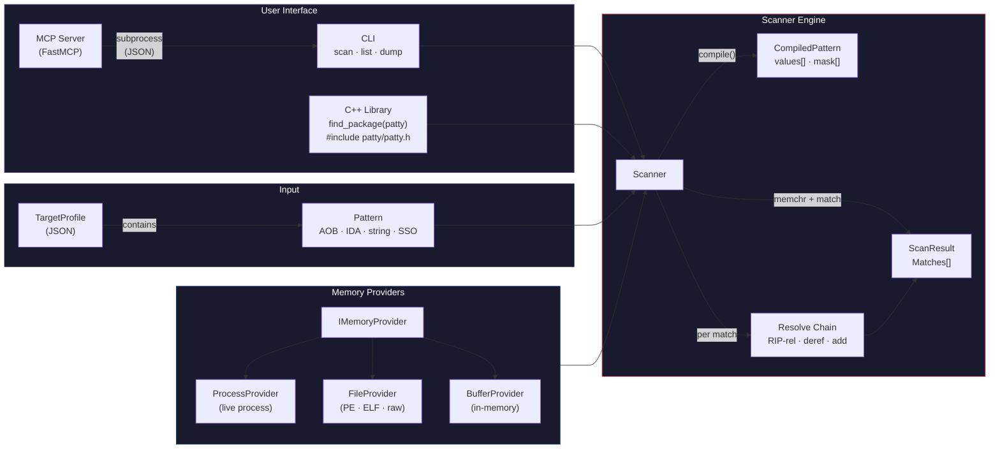
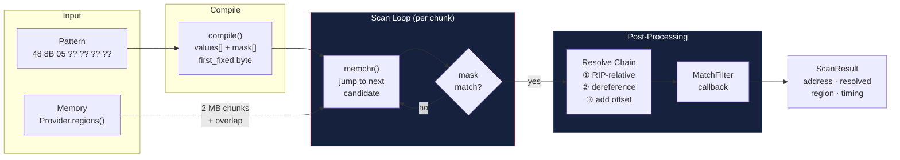

# patty

Fast, universal memory pattern scanner. patty ships as both an installable C++ library and a standalone CLI, while the MCP server stays a thin adapter over the same engine/CLI surface. It scans live Windows processes and binary files for byte patterns (AOB signatures) with automatic RIP-relative resolution, pointer chain following, and PE/ELF section parsing.

~580 MB/s scan throughput on x86-64. Scans a full process address space in under 2 seconds.

## Architecture



## Scan Pipeline



## Build

Requires C++20, CMake 3.20+, and a C++ compiler (GCC, Clang, or MSVC).

```bash
cmake -S . -B build -DCMAKE_BUILD_TYPE=Release
cmake --build build
```

### Common CMake options

| Option | Default | Purpose |
|--------|---------|---------|
| `BUILD_SHARED_LIBS` | `OFF` | Build `patty` as a shared library instead of a static library |
| `PATTY_BUILD_CLI` | `ON` | Build/install the standalone `patty` executable |
| `PATTY_BUILD_TESTS` | `ON` | Build the GoogleTest suite |

Dependencies are resolved via `find_package(...)` first and fall back to `FetchContent` when needed:
- [nlohmann/json](https://github.com/nlohmann/json) — JSON profile loading
- [CLI11](https://github.com/CLIUtils/CLI11) — CLI argument parsing
- [GoogleTest](https://github.com/google/googletest) — tests (optional)

### Install

```bash
cmake -S . -B build -DCMAKE_BUILD_TYPE=Release
cmake --build build
cmake --install build --prefix ./out/install
```

This installs:
- `bin/patty` (CLI, when `PATTY_BUILD_CLI=ON`)
- `include/patty/...` (public headers, including generated `version.h`)
- `lib/patty.lib` / `lib/libpatty.a` / shared library artifacts
- `lib/cmake/patty/pattyConfig.cmake` and exported targets for downstream CMake consumers

## CLI Usage

```bash
# Scan a binary file for an AOB pattern
patty scan --file target.exe --pattern "48 8B 05 ?? ?? ?? ??" --code-only

# Scan with RIP-relative resolution and custom scan tuning
patty scan --file target.exe --pattern "48 8D 0D ?? ?? ?? ??" --resolve rip --max 10 --parallel --threads 4

# Scan for an exact ASCII string
patty scan --name game.exe --string "TaskScheduler" --data-only

# Scan for a numeric value or pointer-sized address
patty scan-value --file dump.bin --value 0x1122334455667788 --size 8 --output json
patty scan-pointer --name game.exe --address 0x7FF612340000 --output json
patty scan-pointers --name game.exe --address 0x7FF612340000 --address 0x7FF612341000 --parallel

# Probe an object / region layout
patty probe --name game.exe --address 0x7FF612340000 --size 0x200 --output json

# Scan with a target profile (multiple patterns at once)
patty scan --name game.exe --profile targets/myprofile.json --output json

# List memory regions
patty list --name explorer.exe
patty list --file target.exe

# Dump a memory region (Windows live-process only)
patty dump --name game.exe --region 7FF6A0010000 --size 4096 --output region.bin
```

### Shared scan flags

Most scan commands share the same execution controls:

- `--code-only` / `--data-only`
- `--module <name>`
- `--max <n>`
- `--parallel`
- `--threads <n>`
- `--chunk-size <bytes>`
- `--output table|json`

Dedicated commands expose the same tuning surface where it makes sense (`scan`, `scan-value`, `scan-pointer`, `scan-pointers`).

### Output Formats

JSON output is now explicitly versioned with `schema_version: 1` for the CLI machine contract.
For `scan*` commands the top-level object keeps `results`, `elapsed_ms`, and `bytes_scanned`, and adds `schema_version` + `command`.
For `probe`, the top-level object is `{"schema_version", "command", "address", "probed_size", "fields"}`.
For `list`, the CLI now returns `{"schema_version", "command", "regions": [...]}`; the MCP `list_regions` tool preserves its legacy bare-array response for compatibility.

**Table** (default):
```
Scanned 695 KB in 1.3 ms

[PlayerBase] 2 match(es)
  0x0000000140004FC2 -> 0x00000001400E0940 (.text)
  0x00000001400086F8 -> 0x00000001400B8BD0 (.text)
```

**JSON** (`--output json`):
```json
{
  "bytes_scanned": 712192,
  "elapsed_ms": 1.3,
  "results": [
    {
      "pattern": "PlayerBase",
      "count": 2,
      "matches": [
        { "address": "0x0000000140004FC2", "resolved": "0x00000001400E0940", "region": ".text" }
      ]
    }
  ]
}
```

## Target Profiles

Define scan targets as JSON files with multiple patterns:

```json
{
  "name": "MyTarget",
  "version": "1.0",
  "module": "game.exe",
  "patterns": [
    {
      "name": "PlayerBase",
      "aob": "48 8B 05 ?? ?? ?? ?? 48 85 C0 74",
      "result_offset": 3,
      "resolve": ["rip_relative"]
    },
    {
      "name": "EntityList",
      "aob": "4C 8B 25 ?? ?? ?? ?? 4D 85 E4",
      "result_offset": 3,
      "resolve": ["rip_relative", "dereference"]
    }
  ]
}
```

## Library Usage

### CMake package consumption

After installing patty, downstream CMake projects can link it via the exported package:

```cmake
find_package(patty CONFIG REQUIRED)

add_executable(my_tool main.cpp)
target_link_libraries(my_tool PRIVATE patty::patty)
```

For build-tree consumption during local development, point `patty_DIR` at `<build-dir>/cmake`.

```cpp
#include <patty/patty.h>

printf("patty %.*s\n", static_cast<int>(patty::version_string.size()), patty::version_string.data());

// Scan a file
auto file = patty::FileProvider::open("target.exe");
auto scanner = patty::Scanner(std::make_shared<patty::FileProvider>(std::move(*file)));

auto pattern = patty::Pattern::fromAOB("48 8B 05 ?? ?? ?? ??", "GlobalPtr")
    .withOffset(3)
    .withResolve(patty::ResolveType::RIPRelative);

auto result = scanner.scanCode(pattern);
for (const auto& match : result.matches)
    printf("0x%llX -> 0x%llX\n", match.address, match.resolved);

// Scan a live process
auto proc = patty::ProcessProvider::openByName("game.exe");
auto scanner2 = patty::Scanner(std::make_shared<patty::ProcessProvider>(std::move(*proc)));
auto result2 = scanner2.scan(pattern, patty::ScanConfig::codeOnly());

// Multi-pattern scan (single pass, faster)
std::vector<patty::Pattern> patterns = { pattern1, pattern2, pattern3 };
auto multi = scanner.scan(std::span(patterns));

// Scan with validation filter — only keep matches where resolved value > 0x10000
auto filtered = scanner.scan(pattern, config, [&](const patty::Match& m) {
    auto val = provider->read<uintptr_t>(m.resolved);
    return val && *val > 0x10000;
});

// Reverse pointer search — find all pointers to a known address
auto xrefs = scanner.scanForPointer(0x7FF612340000, patty::ScanConfig::dataOnly());

// Batch pointer search — single pass for N targets
std::vector<uintptr_t> targets = { addr1, addr2, addr3 };
auto batch = scanner.scanForPointers(std::span(targets));

// Probe an object's memory layout
auto probe = scanner.probeObject(obj_addr, 0x200);
for (const auto& f : probe.fields)
    printf("+0x%X: %s %s\n", f.offset, f.classification.c_str(), f.detail.c_str());

// String patterns
auto str_pat = patty::Pattern::fromString("TaskScheduler");
auto sso_pat = patty::Pattern::fromSSOString("PlayerName");

// Wrap an existing process handle (non-owning)
auto prov = patty::ProcessProvider::fromHandle(my_handle, false);

// Build regions without memorizing Windows PAGE_* constants
auto region = patty::MemoryRegion::make(0x1000, 0x2000, true, true, false, ".data");

// Pointer chain resolution
auto addr = patty::resolve::pointerChain(*provider, base, {0x10, 0x08, 0x00});
```

## MCP Server

The `mcp/` directory contains a [FastMCP](https://gofastmcp.com) server that exposes patty as MCP tools for Claude Code or any MCP-compatible client. Today the server shells out to the `patty` CLI, so keeping the CLI installed (or pointing `PATTY_EXE` at a build-tree binary) is the recommended standalone + MCP setup.

### Setup

```bash
pip install fastmcp
```

Add to your `.mcp.json` (project-level) or `~/.claude.json` (global):

```json
{
  "mcpServers": {
    "patty": {
      "command": "python",
      "args": ["path/to/patty/mcp/server.py"]
    }
  }
}
```

Set `PATTY_EXE` environment variable if the patty binary isn't in a default build directory. A local install prefix keeps CLI + MCP usage stable without depending on repo-relative build folders.

### Available Tools

| Tool | Description |
|------|-------------|
| `scan_process` | Scan a live process by name |
| `scan_process_by_pid` | Scan a live process by PID |
| `scan_file` | Scan a binary file |
| `scan_with_profile` | Scan using a JSON target profile |
| `scan_value` | Scan a process/file for an exact numeric value |
| `scan_pointer` | Scan a process/file for one pointer-sized address |
| `scan_pointers` | Scan a process/file for multiple pointer-sized addresses |
| `probe_object` | Probe an object/region layout and classify fields |
| `list_regions` | List memory regions |
| `dump_memory` | Dump a memory region to file |
| `multi_scan_process` | Multi-pattern scan on a process |
| `multi_scan_file` | Multi-pattern scan on a file |
| `find_string_references` | Find ASCII string occurrences |

## Pattern Formats

| Format | Example | Description |
|--------|---------|-------------|
| AOB | `48 8B 05 ?? ?? ?? ??` | Space-separated hex bytes, `??` for wildcards |
| IDA | `48 8B 05 ? ? ? ?` | Same as AOB, single `?` per wildcard |
| Byte+Mask | `\x48\x8B\x05...` + `xxx????` | Raw bytes with mask string |
| String | `"TaskScheduler"` | Raw ASCII bytes via `Pattern::fromString()` |
| SSO String | `"Hello"` | Matches MSVC x64 `std::string` SSO layout (32 bytes) via `Pattern::fromSSOString()` |

## Performance

Benchmarks on Windows 11, AMD Ryzen 9 (release build, `-O2`):

| Target | Size | Time |
|--------|------|------|
| Binary file | 1 MB | 1.3 ms |
| explorer.exe (code only) | 324 MB | 0.7 s |
| explorer.exe (all memory) | 900 MB | 1.6 s |

Key optimizations:
- `memchr`-based first-byte scanning (SIMD-accelerated)
- Compiled patterns with separate value/mask arrays
- Per-thread buffer reuse across chunks
- First-byte lookup table for multi-pattern scans

## License

Non-commercial use only. See [LICENSE](LICENSE).
