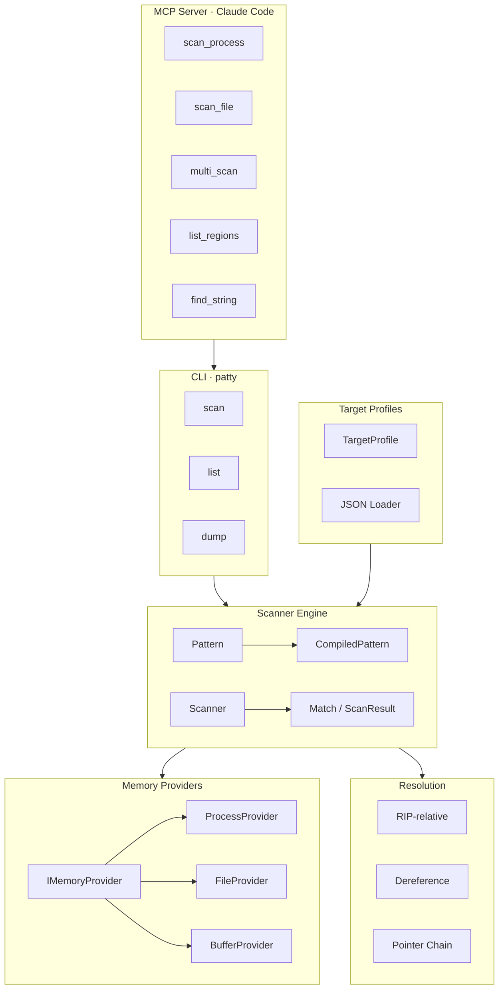
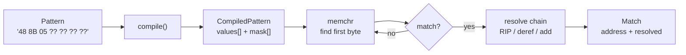

# patty

Fast, universal memory pattern scanner. Scans live Windows processes and binary files for byte patterns (AOB signatures) with automatic RIP-relative resolution, pointer chain following, and PE/ELF section parsing.

~580 MB/s scan throughput on x86-64. Scans a full process address space in under 2 seconds.

## Architecture



## Scan Flow



## Build

Requires C++20, CMake 3.20+, and a C++ compiler (GCC, Clang, or MSVC).

```bash
mkdir build && cd build
cmake .. -DCMAKE_BUILD_TYPE=Release
cmake --build .
```

Dependencies (fetched automatically via CMake FetchContent):
- [nlohmann/json](https://github.com/nlohmann/json) — JSON profile loading
- [CLI11](https://github.com/CLIUtils/CLI11) — CLI argument parsing
- [GoogleTest](https://github.com/google/googletest) — tests (optional, `-DPATTY_BUILD_TESTS=OFF` to skip)

## CLI Usage

```bash
# Scan a binary file for a pattern
patty scan --file target.exe --pattern "48 8B 05 ?? ?? ?? ??" --code-only

# Scan with RIP-relative resolution
patty scan --file target.exe --pattern "48 8D 0D ?? ?? ?? ??" --resolve rip --max 10

# Scan a live process
patty scan --name game.exe --pattern "48 8B 05 ?? ?? ?? ??" --code-only

# Scan with a target profile (multiple patterns at once)
patty scan --name game.exe --profile targets/myprofile.json --output json

# List memory regions
patty list --name explorer.exe
patty list --file target.exe

# Dump a memory region
patty dump --name game.exe --region 7FF6A0010000 --size 4096 --output region.bin
```

### Output Formats

**Table** (default):
```
Scanned 695 KB in 1.3 ms

[PlayerBase] 2 match(es)
  0x0000000140004FC2 -> 0x00000001400E0940 (.text)
  0x00000001400086F8 -> 0x00000001400B8BD0 (.text)
```

**JSON** (`--output json`):
```json
{
  "bytes_scanned": 712192,
  "elapsed_ms": 1.3,
  "results": [
    {
      "pattern": "PlayerBase",
      "count": 2,
      "matches": [
        { "address": "0x0000000140004FC2", "resolved": "0x00000001400E0940", "region": ".text" }
      ]
    }
  ]
}
```

## Target Profiles

Define scan targets as JSON files with multiple patterns:

```json
{
  "name": "MyTarget",
  "version": "1.0",
  "module": "game.exe",
  "patterns": [
    {
      "name": "PlayerBase",
      "aob": "48 8B 05 ?? ?? ?? ?? 48 85 C0 74",
      "result_offset": 3,
      "resolve": ["rip_relative"]
    },
    {
      "name": "EntityList",
      "aob": "4C 8B 25 ?? ?? ?? ?? 4D 85 E4",
      "result_offset": 3,
      "resolve": ["rip_relative", "dereference"]
    }
  ]
}
```

## Library Usage

```cpp
#include <patty/patty.h>

// Scan a file
auto file = patty::FileProvider::open("target.exe");
auto scanner = patty::Scanner(std::make_shared<patty::FileProvider>(std::move(*file)));

auto pattern = patty::Pattern::fromAOB("48 8B 05 ?? ?? ?? ??", "GlobalPtr")
    .withOffset(3)
    .withResolve(patty::ResolveType::RIPRelative);

auto result = scanner.scanCode(pattern);
for (const auto& match : result.matches)
    printf("0x%llX -> 0x%llX\n", match.address, match.resolved);

// Scan a live process
auto proc = patty::ProcessProvider::openByName("game.exe");
auto scanner2 = patty::Scanner(std::make_shared<patty::ProcessProvider>(std::move(*proc)));
auto result2 = scanner2.scan(pattern, patty::ScanConfig::codeOnly());

// Multi-pattern scan (single pass, faster)
std::vector<patty::Pattern> patterns = { pattern1, pattern2, pattern3 };
auto multi = scanner.scan(std::span(patterns));

// Pointer chain resolution
auto addr = patty::resolve::pointerChain(*provider, base, {0x10, 0x08, 0x00});
```

## MCP Server

The `mcp/` directory contains a [FastMCP](https://gofastmcp.com) server that exposes patty as MCP tools for Claude Code or any MCP-compatible client.

### Setup

```bash
pip install fastmcp
```

Add to your `.mcp.json` (project-level) or `~/.claude.json` (global):

```json
{
  "mcpServers": {
    "patty": {
      "command": "python",
      "args": ["path/to/patty/mcp/server.py"]
    }
  }
}
```

Set `PATTY_EXE` environment variable if the patty binary isn't in a default build directory.

### Available Tools

| Tool | Description |
|------|-------------|
| `scan_process` | Scan a live process by name |
| `scan_process_by_pid` | Scan a live process by PID |
| `scan_file` | Scan a binary file |
| `scan_with_profile` | Scan using a JSON target profile |
| `list_regions` | List memory regions |
| `dump_memory` | Dump a memory region to file |
| `multi_scan_process` | Multi-pattern scan on a process |
| `multi_scan_file` | Multi-pattern scan on a file |
| `find_string_references` | Find ASCII string occurrences |

## Pattern Formats

| Format | Example | Description |
|--------|---------|-------------|
| AOB | `48 8B 05 ?? ?? ?? ??` | Space-separated hex bytes, `??` for wildcards |
| IDA | `48 8B 05 ? ? ? ?` | Same as AOB, single `?` per wildcard |
| Byte+Mask | `\x48\x8B\x05...` + `xxx????` | Raw bytes with mask string |

## Performance

Benchmarks on Windows 11, AMD Ryzen 9 (release build, `-O2`):

| Target | Size | Time |
|--------|------|------|
| Binary file | 1 MB | 1.3 ms |
| explorer.exe (code only) | 324 MB | 0.7 s |
| explorer.exe (all memory) | 900 MB | 1.6 s |

Key optimizations:
- `memchr`-based first-byte scanning (SIMD-accelerated)
- Compiled patterns with separate value/mask arrays
- Per-thread buffer reuse across chunks
- First-byte lookup table for multi-pattern scans

## License

Non-commercial use only. See [LICENSE](LICENSE).
